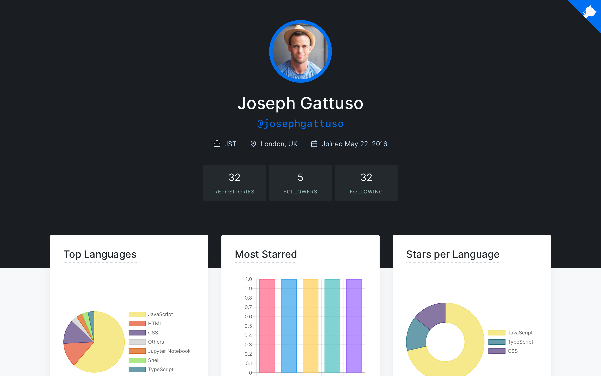

<div align="center">
  
  <h1>
    <a href="https://profiles.gattuso.dev" target="_blank" rel="noopener noreferrer nofollow">
      DevProfiles
    </a>
  </h1>
  <p align="center">
    Search for any GitHub profile and return key information using the GitHub API. Built with Next.js and Styled Components
  </p>
  <p align="center">
    <a href="https://github.com/josephgattuso/dev-profiles/blob/main/LICENSE">
      
    </a>
    <a href="https://github.com/josephgattuso/dev-profiles/pulls">
      
    </a>
    <a href="https://github.com/josephgattuso/dev-profiles/commits/main">
      
    </a>
    <a target="_blank"
      href="https://twitter.com/intent/follow?screen_name=joeetuso">
      
    </a>
  </p>
</div>



## 🚀 Getting started

First, run the development server:

```sh
npm run dev
# or
yarn dev
```

Open [http://localhost:3000](http://localhost:3000) with your browser to see the result.

## 📚 Resources

- [Chart.js](https://www.chartjs.org/) - Simple, clean and engaging HTML5 based JavaScript charts.
- [GitHub Polyglot](https://github.com/IonicaBizau/node-gh-polyglot) - Get language stats about GitHub users and repositories.
- [Next.js Deployment](https://nextjs.org/docs/deployment) - the easiest way to deploy your Next.js app.
- [Next.js Docs](https://nextjs.org/docs) - Learn about Next.js features and API.
- [Next.js Learning](https://nextjs.org/learn) - An interactive Next.js tutorial.
- [Next.js Repo](https://github.com/vercel/next.js/) - Open-source GitHub repository.
- [React Flip Move](https://github.com/joshwcomeau/react-flip-move) - Effortless animation between DOM changes using the FLIP technique.
- [Styled Components](https://styled-components.com/) - Use the best bits of ES6 and CSS to style your apps without stress.
- [Vercel Platform](https://vercel.com) - from the creators of Next.js.
